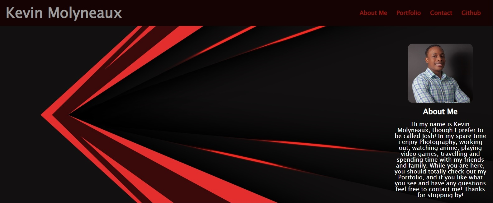
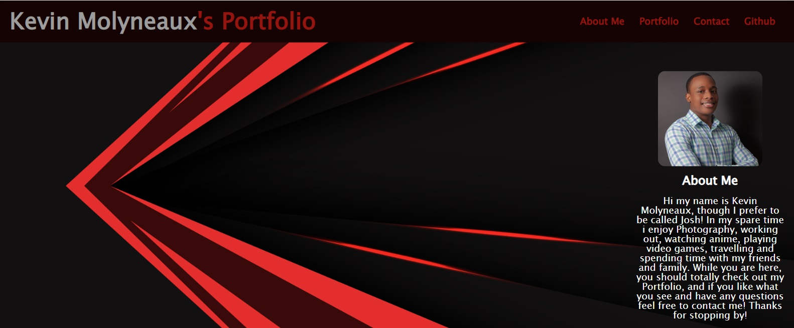
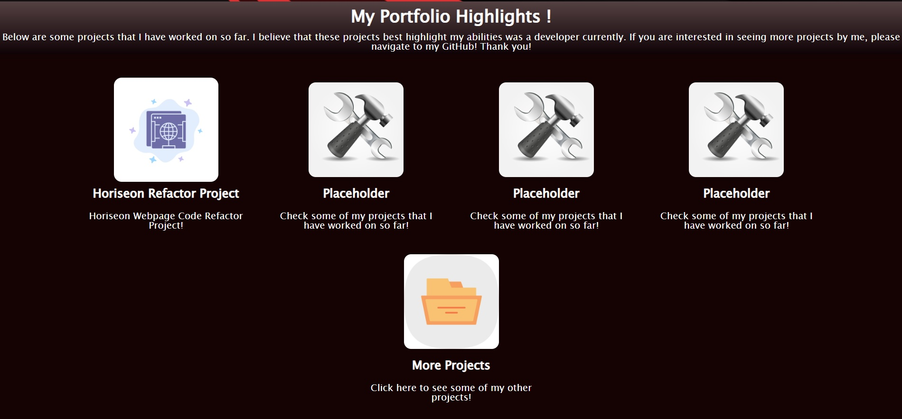
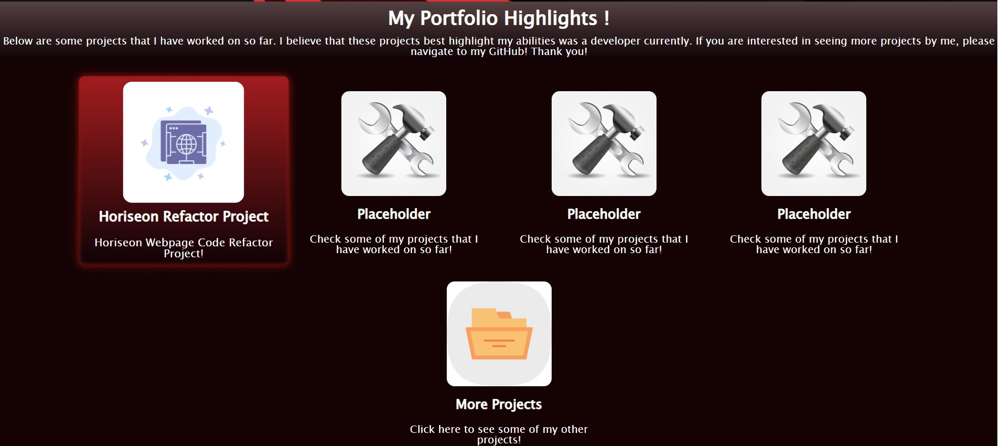
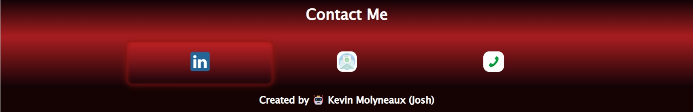

# Personal Portfolio

## Description

Created a personal portfolio using HTML and CSS to highlight myself as well as some projects that I have worked on so far.
This webpage consists of an About Me section, Portfolio highlights section, and a contact me section. There is also a link to my Github in the nav bar, as well as the Portfolio highlights.

Published website:   https://molyneauxk93.github.io/KevinMolyneaux-Personal-Portfolio/

## Installation

N/A

## Usage

Visit Kevin Molyneaux's portfolio to learn a bit about him as well as some projects he has worked on to date. You can also contact him by navigating to that section of the page and selecting your desired method of contact. 

## Credits

The images in my webpage were attained from the following sources: 

Portfolio graphic image source: 

<a href="https://www.vecteezy.com/vector-art/5240249-abstract-red-black-metallic-arrow-speed-direction-geometric-design-modern-technology-futuristic-background-vector">Abstract red black metallic arrow speed direction geometric design modern technology futuristic background vector Vectors by Vecteezy</a>

Horiseon icon: 

<a href="https://www.vecteezy.com/vector-art/14332438-brower-internet-web-globe-blue-icon-on-abstract-cloud-background">Brower Internet Web Globe Blue Icon on Abstract Cloud Background Vectors by Vecteezy</a>

Placeholder icon: 

<a href="https://www.vecteezy.com/vector-art/8407035-hammer-and-wrench-icon-vector-illustration">Hammer and Wrench icon vector illustration Vectors by Vecteezy</a>

Folder Icon: 

<a href="https://www.vecteezy.com/vector-art/16982706-folder-vector-icon-design">Folder Vector Icon Design Vectors by Vecteezy</a>

Email icon: 

<a href="https://www.vecteezy.com/vector-art/17983022-mail-email-envelope-education-abstract-circle-background-flat-color-icon">Mail Email Envelope Education Abstract Circle Background Flat color Icon Vectors by Vecteezy</a>

Phone graphic: 

<a href="https://www.freepik.com/free-vector/phone_2900473.htm#query=phone%20graphics&position=2&from_view=search&track=sph">Image by rawpixel.com</a> 

## License

MIT License - Please refer to the LICENSE in the repo.

## Usage
The following image shows the default header and nav on my portfolio along with my About Me card:

The follwing image shows the header when you hover over my name 'Kevin Molyneaux':

The following image shows the Portfolio highlights with the first image card image being  slightly larger than the others: 

The following image shows how a card looks when you hover over it: 

The following section is the Contact me section, showing three contact options. Linkedin, Email, and Phone.

